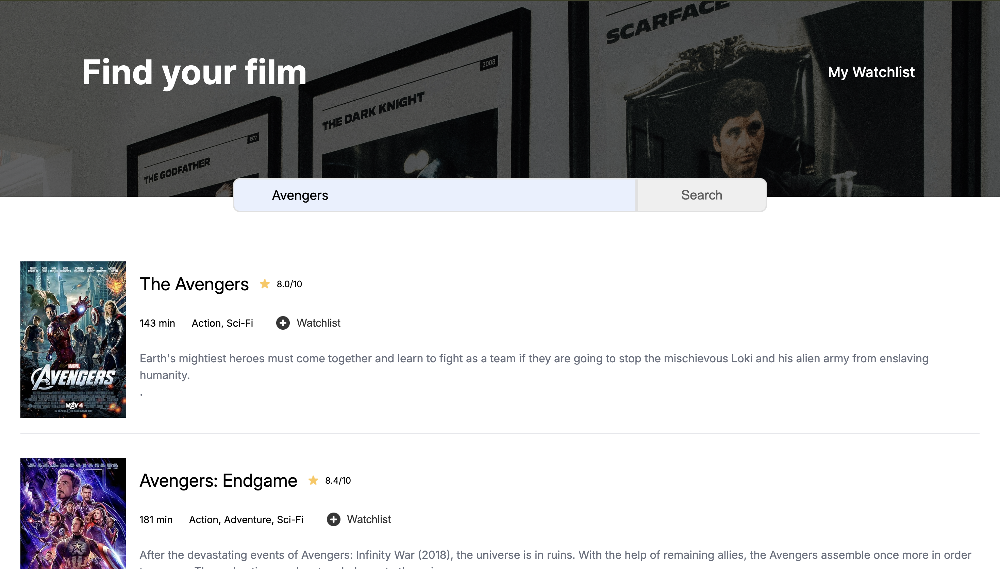
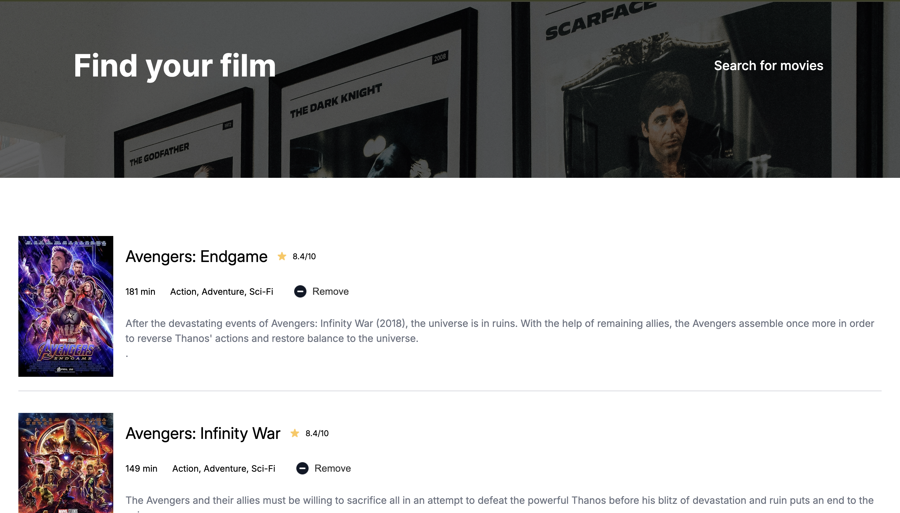

## Movie Watchlist
A small client-side web app to search movies (OMDb) and save a personal watchlist in localStorage.

It uses https://www.omdbapi.com/ API to get movies.

Built with simple HTML5, CSS3, vanilla JavaScript and OMDb API.

Happy movie hunting!

[ Let's Try in Live :)](https://gmarav05.github.io/movie-watchlist/)

## Video

## Image

## Features

- Search for movies by title (uses OMDb search endpoint).

- Users can click to add movies to a watchlist and view them on the "My Watchlist" page.

- It uses `localStorage` on the browser to store Watchlist.

- It also gets details like Rating, Duration, Genre and description.

## Learnings

- Practiced fetching data from APIs and rendering it dynamically on the DOM.

- Learned how to store and retrieve data from localStorage.

- Practiced more CSS flexbox.

- Practise of creating multi page website.

## Live demo

[ View Live  :)](https://gmarav05.github.io/movie-watchlist/)
 